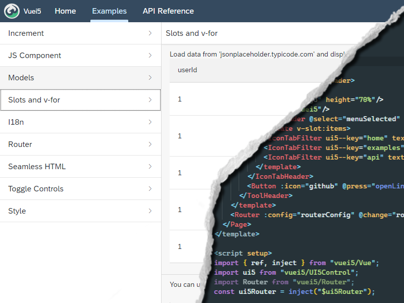

# Vuei5 - Vue.js for native UI5 apps

Vuei5 allows you to build [UI5](https://openui5.org/) apps using [vuejs](https://vuejs.org/). The resulting apps can be used both in standalone mode and in sap launchpad. UI5 Controls will be wrapped as vue components that can be used with the usual vuejs features. The components will then be added to the regular ui5 component system. It is also possible to let only a part of the app be controlled by vuei5. This project **does not** use webcomponents. Just the regular UI5 controls.

<p align="center">

</p>
<br/>

<!--  -->

> ⚠ **Should be obvious but:**
>
> This project is experimental and it's probably a really bad idea to use it in production! It's basically just held together by ducktape. It could break at any moment.

## What works and what doesn't

Suprisingly a lot of things actually work as they should. Not everything is tested thoroughly but here is a quick overview of what is currently doable:

**Works**

- ✔ UI5 components in Vue
- ✔ v-bind on ui5 components
- ✔ v-model on ui5 components
- ✔ v-on on ui5 components
- ✔ Slots to nest ui5 components
- ✔ i18n translations in vue
- ✔ UI5 Routing system in vue
- ✔ .vue Single file components
- ✔ .vue &lt;script setup&gt; tag
- ✔ Pug templates in .vue files
- ✔ Render HTML inside ui5 app
- ✔ ESM in .vue files (actually required)
- ✔ Convert JSON Model to vue refs
- ✔ style in .vue files
- ✔ Babel Sourcemaps

**Doesn't work / Work in progress**

- ❌ Typescript support
- ❌ v-show (bind to :visible instead)

## Installation

Add the package to your project as a dev dependency.

```sh
npm i -D @todms/vuei5
```

Add the package to the ui5 dependencies of `package.json`

```yaml
"ui5": {
  "dependencies": [
    #...
    "vuei5",
  ]
}
```

If you want to use .vue sfc files include task and middleware in `ui5.yaml`

Task:

```yaml
builder:
  customTasks:
    - name: vuei5-task-sfc
      beforeTask: generateComponentPreload
```

Middleware:

```yaml
server:
  customMiddleware:
    - name: vuei5-middleware-sfc
      beforeMiddleware: serveResources
```

## Updating vue.js

On installation the newest version of vue.js will be downloaded from a cdn ([unpkg.com/vue@next/](https://unpkg.com/vue@next/dist/vue.esm-browser.prod.js)) and converted from esm to a ui5 module.

If you want to update or reinstall your vuejs version you can execute the script manually

```sh
node node_modules/vuei5/scripts/updateVue.js [<cdnURL>]
```

## Documentation

[View Documentation](https://todm.github.io/vuei5);

The documentation page was created with vuei5 and can be used as a working example. You can find it's source code in `/docs`.

## Quickstart

Make sure you've followed the [installation steps](#installation) to make vuei5 available in your project. Then initialize vuei5. Either for the whole app or just a part of it.


### Initializing vuei5 for the whole app

To let vue control the whole app you need to modify your `Component.js` file. Just change the default `UIComponent` to the vuei5 `VUEIComponent`. You can also still add your usual ui5 configuration since `VUEIComponent` extends `UIComponent`.

To make the app work you at least have to specify the root vue component to render on the page.

```js
//Component.js

sap.ui.define(
  [
    "vuei5/VUEIComponent",
    "./components/Home", // also import your root vue component
  ],
  function (VUEIComponent, Home) {
    "use strict";

    // Simply replace UIComponent with VUEIComponent.
    return VUEIComponent.extend("vuei5.demo.Component", {
      metadata: {
        manifest: "json",
      },

      vuei5: {
        vueRoot: Home,
      },
    });
  }
);
```

With this configuration the app should now render your specified root vue component.

### Initializing vuei5 for part of the app

To let vue control only part of the app you need to launch it inside of a controller while passing it a reference to the parent element.

```js
// App.controller.js

sap.ui.define(
  [
    "sap/ui/core/mvc/Controller",
    "vuei5/Launcher", //import vuei5 Launcher
    "../components/Home", //import your root vue component
    //...
  ],
  function (Controller, vuei5Launcher, Home) {
    return Controller.extend("vuei5.demo.controller.App", {
      //...

      onInit: function () {
        // get your parent ui5 element
        const element = this.byId("myParentElement");

        vuei5Launcher(element, Home, {
          /* Options */
        });
      },

      //...
    });
  }
);
```

With this configuration the contents of the root vue component shoulod now be added to your specfied parent ui5 element.

### Writing components and importing ui5 controls

You can write your components both in `.vue` sfc files and in standard `.js` files. If you want to use .vue files make sure that you correctly installed the [sfc task / middleware](#task-and-middleware) wich will automatically transform them into normal js files. Also note that it's mandatory to use **ES Modules in .vue files**. They will be resolved by the task.

To import and use a ui5 control in your vue component use the `UI5Control` function. It will take in a Control or a String and will return a vue-ready component. If you provide the function with a string instead of a control it will load it synchronously with `sap.ui.requireSync()`.

If you use a control multiple times it's a good idea to register it globally.  > See Documentation

**Writing components in .vue files:**

```html
<!-- MyComponent.vue -->
<template>
  <VBox>
    <Text text="Hello World" />
  </VBox>
</template>

<script>
  import UI5Control from "vuei5/UI5Control";
  import VBox from "sap/m/VBox";

  export default {
    components: {
      // you can pass a amd loaded control
      VBox: UI5Control(VBox),

      // or a string wich will load the control with sap.ui.requireSync();
      Text: UI5Control("sap/m/Text"),
    },
  };
</script>
```

**The same component in vanilla js:**

```js
sap.ui.define(["vuei5/UI5Control", "sap/m/VBox"], function (UI5Control, VBox) {
  return {
    template: `<VBox><Text text="Hello World"/></VBox>`,
    components: {
      // you can pass a amd loaded control
      VBox: UI5Control(VBox),

      // or a string wich will load the control with sap.ui.requireSync();
      Text: UI5Control("sap/m/Text"),
    },
  };
});
```

In a `<script setup>` tag just asign the result to a constant:

```html
<script setup>
  import ui5 from "vuei5/UI5Control";

  // Component will be available as <Button/>
  const Button = ui5("sap/m/Button");
</script>
```

### Interact with ui5 vue components

Interacting with ui5 vue components is, with a few exceptions, the same as interacting with any other vue component. You can bind data with `v-bind` or `:` use `v-if`, `v-for` and listen to events with `v-on` or `@`

It does not matter if you use the options api or the composition api and even the new `<script setup>` tag will work.

```html
<!-- MyComponent.vue -->
<template>
  <VBox>
    <Text :text="count" />
    <button text="Click me!" @press="increment" />
  </VBox>
</template>

<script>
  import UI5Control from "vuei5/UI5Control";
  import VBox from "sap/m/VBox";
  import { ref } from "vuei5/Vue";

  export default {
    components: {
      VBox: UI5Control(VBox),
      Text: UI5Control("sap/m/Text"), //Will import sync
      Button: UI5Control("sap/m/Button"), //Will import sync
    },

    setup() {
      const count = ref(0);
      function increment() {
        count.value++;
      }
      return { count, increment };
    },
  };
</script>
```

### Aggregations

Many ui5 controls have aggregations that allow you to define child controls. In vuei5 you can achive this by adding them as children. Without any configuration the controls will be attached with a `default` aggregation. You can specify a diffrent one by setting `v-slot` on a template or by defining `ui5--aggregation` on a single control.

```html
<m-Table>
  <!-- Will be added with default aggregation -->
  <MyComponent/>

  <template v-slot:headerToolbar>
    <!-- Will be added with headerToolbar aggregation -->
    <MyComponent/>
  </template>

  <template v-slot:columns>
    <!-- Will be added with columns aggregation -->
    <MyComponent/>
  </template>

  <!-- Will be added with infoToolbar aggregation -->
  <MyComponent ui5--aggregation="infoToolbar"/>
</m-Table>
```